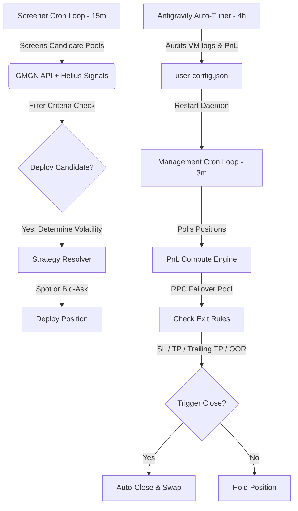

# Meridian System Knowledge Base & Strategy Guide

This document serves as the baseline knowledge base for the Meridian autonomous trading agent ecosystem. It details how the system works, defines the strategy mechanics, records major improvements, and outlines parameters for future references.

---

## 💡 1. Core DLMM Concepts

### What is DLMM?
Meteora's **DLMM (Dynamic Liquidity Market Maker)** organizes liquidity into discrete price **bins**. Unlike traditional AMMs (which spread liquidity infinitely from 0 to infinity), DLMM concentrates liquidity in specific bins.
* **Bin Step**: The price distance between consecutive bins (e.g. a bin step of 100 is equal to a 1% price change per bin).
* **Zero Slippage Trades**: Within a single bin, trades occur with zero slippage.
* **Liquidity Distribution Shapes**:
  1. **Spot**: Distributes liquidity evenly across the configured range.
  2. **Curve**: Concentrates liquidity near the active price bin, sloping downwards.
  3. **Bid-Ask (U-Shape)**: Concentrates liquidity on the outer edges (bypassing the center) to buffer high price swings.

### Single-Sided SOL Deployment
Meridian trades primarily using single-sided SOL deposits:
* **SOL is the Quote Token**: When deploying SOL capital, all liquidity bins are placed **below the active price bin**.
* **Price Movements**:
  * As the price **drops**, the pool converts our SOL into the base token (we buy the token).
  * As the price **pumps**, the pool converts the base token back into SOL (we sell the token).
  * If the price pumps above our range, we hold **100% SOL** (maximum profit secured).
  * If the price dumps below our range, we hold **100% base token** (maximum drawdown).

---

## 🤖 2. Bot System Architecture

The bot runs as a set of coordinated PM2 daemons:

### The Screening Loop (15m interval)
1. Checks wallet balances (skips if SOL balance $< 0.4$ SOL) and active vacancy (maximum 3 positions).
2. Filters out tokens on cooldown.
3. Screens pools on Meteora for high fee-to-TVL ratios, organic volume, and holder growth.
4. Dynamically determines deployment strategy (`spot` or `bid_ask`) based on volatility.
5. Executes the single-sided SOL deploy.

### The Management Loop (3m interval / immediately on alerts)
1. Checks the active price relative to the position range.
2. Tracks unclaimed fees and calculates live position PnL.
3. Computes exit checks:
   * **Stop Loss**: Closes position if PnL drops below limit (e.g., `-19%`).
   * **Take Profit / Trailing TP**: Locks in profit once trigger is hit (e.g., `+20%`) and trails the peak.
   * **Out of Range (OOR)**: Closes positions that sit out-of-range too long.
4. Auto-swaps remaining base tokens back to SOL to capture and secure profits.

---

## 🛠️ 3. Core Parameter Settings (`user-config.json`)

* **`strategy`**: `"dynamic"` — Bot selects the strategy dynamically based on pool volatility.
* **`dynamicVolatilityThreshold`**: `2.5` — Volatility limit separating moderate (`spot` strategy) and high-volatility (`bid_ask` strategy) deployments.
* **`outOfRangeWaitMinutes`**: `15` — The time in minutes before an out-of-range position is closed.
* **`stopLossPct`**: `-19%` — Hard PnL stop-loss.
* **`takeProfitPct`**: `20%` — Target take profit.
* **`trailingTakeProfit`**: `true` — Enables dynamic profit trailing.
* **`pnlSource`**: `"rpc"` — Uses direct RPC queries to calculate position PnL rather than cached APIs.
* **`pnlPollIntervalSec`**: `6` — The frequency of active position value audits.

---

## 📈 4. Log of Historical Improvements

### Milestone 1: RPC Failover Connection Pool
* **Issue**: Alchemy RPCs returned `429 Too Many Requests` due to the 6-second poller frequency.
* **Solution**: Developed a load-balanced RPC connection pool wrapping Helius, Alchemy, and public nodes (`callRpc` in `tools/rpc.js`), routing all position monitoring through it. No 429 errors reported since.

### Milestone 2: Mixed/Dynamic Strategy Resolution
* **Issue**: High-volatility memecoin swings caused large impermanent losses when deployed using `spot` strategy, reducing average yields to `+0.26%`.
* **Solution**: Refactored `deployPosition` to dynamically select the `spot` strategy for steady, moderate-volatility pools (yields `+0.97%`) and `bid_ask` for volatile swings.

### Milestone 3: Programmatic Baseline Deposits scanner
* **Issue**: Calculating profit percentages against a static deposit baseline was prone to error if manual injections or withdrawals occurred.
* **Solution**: Introduced `meridian baseline` which scans on-chain signatures to dynamically sum real capital deposits and write to `state.json`.

---

## 🎯 5. Performance Reflections

Based on historical screening cycles:
* **Trend Accuracy**: The bot's candidate selections hold an **80.00% win rate** under normal market conditions.
* **Capital Recycling**: Speeding up OOR timeouts to 15 minutes allows SOL to be redeployed into active fee-generating pools rapidly when the price pumps above range.
* **Drawdown Management**: Going forward, the primary improvement vector is preventing premature realization of losses during normal market dips by separating above-range and below-range OOR timeouts.
